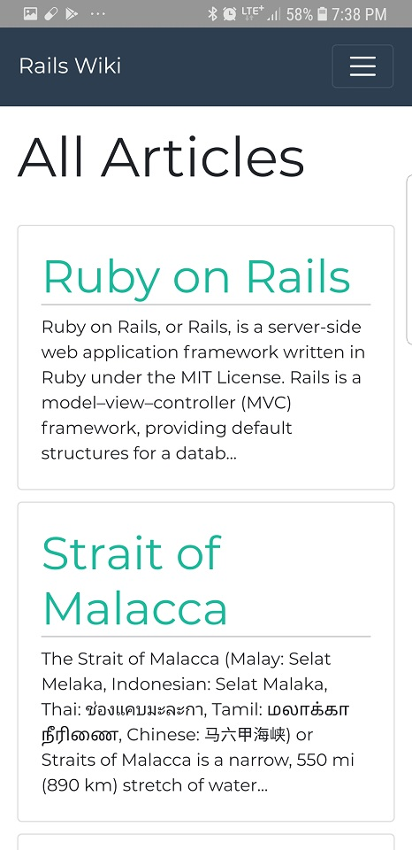
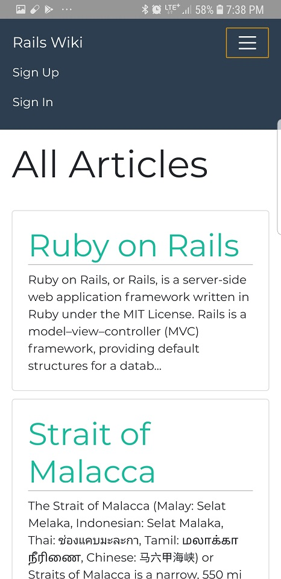
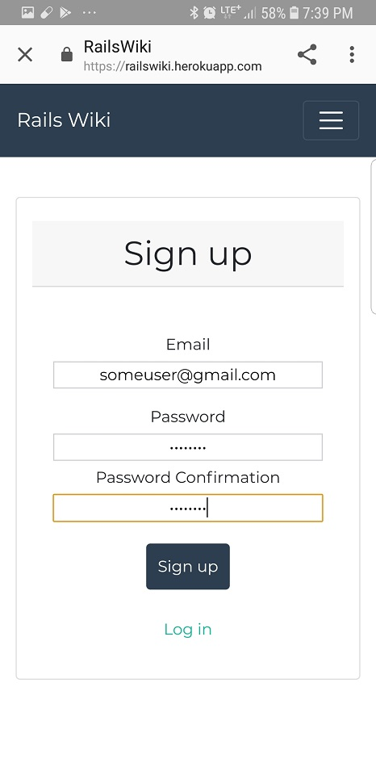
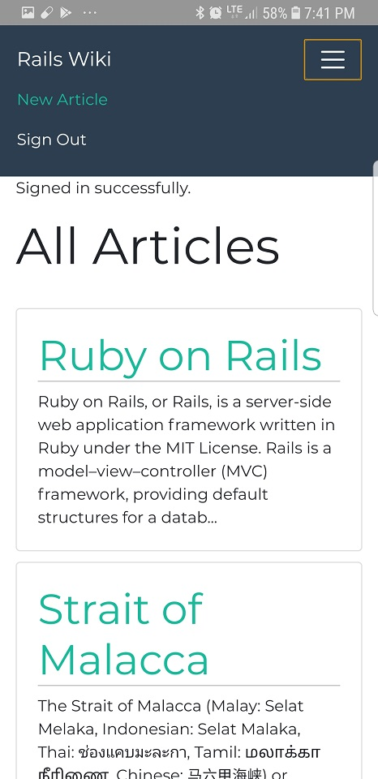
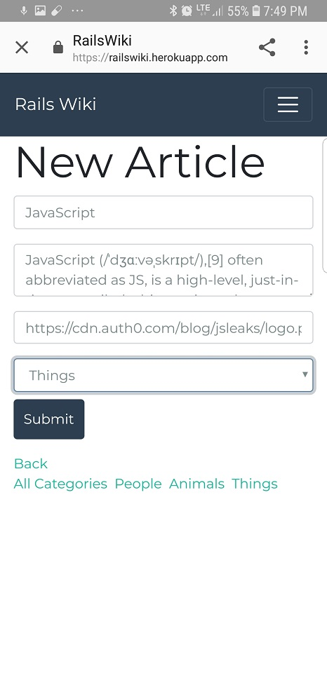
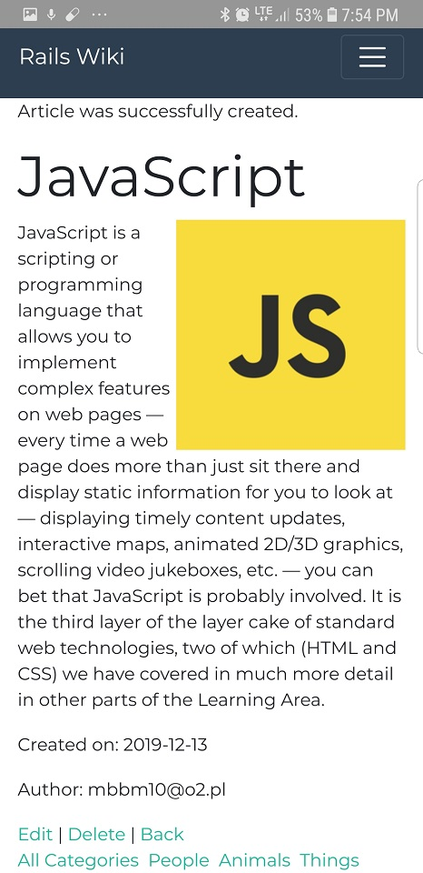
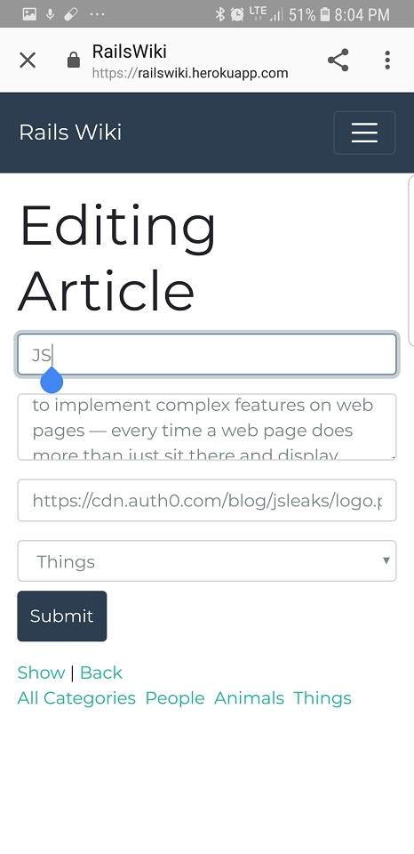
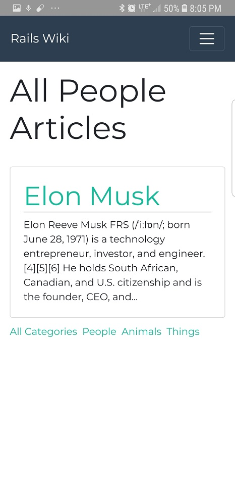

Rails Wiki
=================

A wikipedia-like application created in Ruby on Rails. Users can create an account, sign in and post articles with images. Each user can post multiple articles. Articles appear on the main page of the application and can be viewed by anyone. The articles on the wiki can be easily removed or edited, but only by their author or by administrator.
This application uses database as well as user authentication system.

Tools and technologies used:

* Ruby on Rails
* Devise
* JavaScript
* Travis
* PostgreSQL
* HTML / CSS
* Bootstrap

-----

|   Description    |   Image    |
|:------------:|:----------------:|
|User enters the main page with articles posted by others. | |
|User can make an account. | |
|User can sign up to the application by typing in his email address and creating a password. | |
|By selecting a 'New Article' option from navbar, user can create his own articles. | |
|Creating a new article is very easy. Each article consists of its text, image and a category selected by the user. | |
|New article created. Every new article can be viewed from the main page. | |
|Each article can be edited by its author or by admin.| |
|User can view articles from a specific category. | |

-----

**Heroku**
-------------------------------
This app has been deployed to Heroku:

https://railswiki.herokuapp.com/

-------